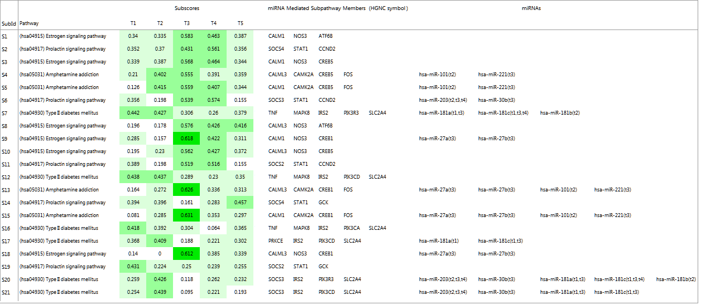

# Table of Contents
1. [Package Setup](#Package Setup)
2. [User Input](#User Input)
3. [Default Run](#Default Run)

## Package Setup
CHRONOS (time-vaRying enriCHment integrOmics Subpathway aNalysis tOol) is an 
R package built to extract regulatory subpathways along with their miRNA 
regulators at each time point based on KEGG pathway maps and user-defined 
time series mRNA and microRNA (if available) expression profiles for 
microarray experiments. It is flexible by allowing the user to intervene and 
adapt all discrete phases to the needs of the study under investigation. 
CHRONOS can assist significantly in complex disease analysis by enabling the 
experimentalists to shift from the dynamic to the more realistic time-varying 
view of the involved perturbed mechanisms.

Before loading the package, please specify a user-accessible home directory. 
The default directories for each architecture are as follows:

```{r eval=TRUE, echo=TRUE}
if (.Platform$OS.type == 'unix') 
    { options('CHRONOS_CACHE'=file.path(path.expand("~"), '.CHRONOS') ) }
if (.Platform$OS.type == 'windows') 
    { options('CHRONOS_CACHE'=file.path(gsub("\\\\", "/",
                            Sys.getenv("USERPROFILE")), "AppData/.CHRONOS")) }
```

## User Input
CHRONOS requires mRNA and microRNA (if available) time-series expression data 
along with their labels. The expression data needs to be formatted in matrices
with dimensions (N, E), where N is the number of mRNAs/ microRNAs and E the 
time points of data (i.e. X(i,j) is the expression value of mRNA/miRNA i at 
time j). In case microRNA expression data are not available, CHRONOS can be 
run without processing and exporting miRNAs in the final subpathways. 
CHRONOS operates more effectively if data are normalized and log2-fold change 
differences relative to an initial condition (control state) are computed. 
Multiple biological replicates should be summarized so that one sample per 
time point is provided as input. An indicative example is:

```{r eval=TRUE, echo=TRUE}
library('CHRONOS')
load(system.file('extdata', 'Examples//data.RData', package='CHRONOS'))
head(mRNAexpr)
```

## Default Run

Next we present a default run of CHRONOS, which 
(i) imports mRNA from CHRONOS/extdata/Input/<mRNAexprFile>.txt and 
miRNA expressions from CHRONOS/extdata/Input/<miRNAexprFile>.txt,
(ii) downloads (all availiable) pathways for a specified organism from KEGG,
(iii) creates pathway graphs from downloaded KGML files,
(iv) extracts linear subpathways from metabolic and non metabolic graphs,
(v) downloads miRecords miRNA-mRNA interactions,
(vi) scores extracted subpathways in order to extract significant results,
(vii) visualizes the most the significant results.

```{r eval=TRUE, echo=TRUE, message=FALSE}
out <- CHRONOSrun(  mRNAexp=mRNAexpr,
                    mRNAlabel='entrezgene',
                    miRNAexp=miRNAexpr,
                    pathType=c('04915', '04917', '04930', '05031'),
                    org='hsa',
                    subType='All',
                    thresholds=c('subScore'=0.4, 'mirScore'=0.4),
                    miRNAinteractions=miRNAinteractions,
                    export='.xlsx')
```


## Citation
The CHRONOS software package itself can be cited as: 
Vrahatis, A. G., Dimitrakopoulou, K., Balomenos, P., Tsakalidis, A. K., & 
Bezerianos, A. (2015). CHRONOS: A time-varying method for microRNA-mediated 
sub-pathway enrichment analysis. Bioinformatics (2016) 32 (6) : 884-892
